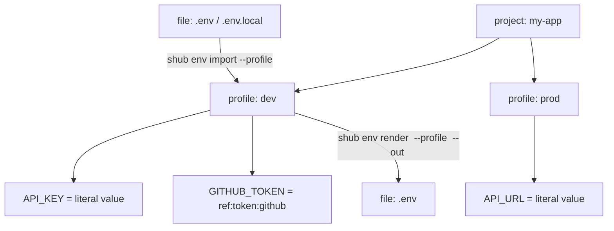

# Secret Hub

Secret Hub is planned as a local-first secret manager for developer workflows:
TOTP codes, API keys, account passwords, and project `.env` values.

## Planned Stack

- Core: Rust workspace
- CLI: Rust + clap
- Desktop: Tauri + Vue + TypeScript
- Storage: local encrypted database, with explicit import/export flows

## Docs

- [Architecture](docs/ARCHITECTURE.md)
- [Development Environment](docs/DEVELOPMENT.md)

## CLI Quick Start

After installation, the command is:

```powershell
shub init
shub add api-key github --key ghp_xxx --provider github --scopes repo,read:user
shub add password example --username alice --password p@ssw0rd
shub add token ci --token token_xxx --service github-actions
shub add totp github --secret BASE32SECRET --issuer GitHub --account alice
shub list
shub get github --reveal
shub get password github --reveal
shub get github --kind password --reveal
shub totp github
shub totp github --copy
shub edit api-key github --key ghp_new --scopes repo,read:user
shub edit password github --password new_password
shub edit token ci --token token_new
shub edit totp github --secret NEWBASE32SECRET --issuer GitHub
shub delete password github
```

Names are unique within the same secret type. Different types may reuse the same
name, such as a TOTP entry and password entry both named `github`. Without a
type filter, `shub get github` prints every matching entry. Deleting always
requires a type: `shub delete <type> <name>`.

Manage project `.env` profiles:

```powershell
shub env import my-app .env --profile dev --replace
shub env set my-app API_KEY --profile dev
shub env set-ref my-app GITHUB_TOKEN github --kind token --profile dev
shub env list --project my-app --profile dev
shub env render my-app --profile dev --out .env --force
```



`project` is the top-level app or repository name inside the vault. `profile`
is one environment under that project, such as `dev`, `test`, or `prod`.
`file` is only the external plaintext `.env` file used when importing from disk
or rendering back to disk.

Values are stored inside the encrypted vault. Rendering writes a plaintext
`.env` file only when requested. `set-ref` stores a reference to an existing
`api-key` or `token`; rendering resolves that reference to the current secret
value. A referenced `api-key` or `token` cannot be deleted until the `.env`
reference is removed or changed.

Use password mode when you want the tool to require login:

```powershell
shub init --password --session-minutes 30
shub login --session-minutes 30
shub set-password
shub remove-password
```

For tests or local experiments, set `SECRET_HUB_HOME` to keep vault files out of
your real user config directory.

## Binary Distribution

The CLI is packaged as a single executable named `shub`.

For local development:

```powershell
cargo build --release -p shub
.\target\release\shub.exe status
```

For end users, publish the release artifact for each platform:

- Windows: `shub.exe`
- macOS Apple Silicon: `shub`
- macOS Intel: `shub`
- Linux: `shub`

Users only need to place the binary somewhere on `PATH`, then run `shub init`.

macOS users can install the universal release build like this:

```bash
tar -xzf shub-macos-universal.tar.gz
chmod +x shub
mkdir -p "$HOME/bin"
mv shub "$HOME/bin/shub"
shub init
```

If macOS blocks an unsigned downloaded binary, remove the quarantine attribute:

```bash
xattr -d com.apple.quarantine "$HOME/bin/shub"
```

## Desktop Client

The desktop client lives in `apps/desktop` and uses Tauri + Vue + TypeScript.
It reuses `secret-hub-core`, so Windows and macOS clients operate on the same
local encrypted vault as the CLI.

Development:

```powershell
cd apps/desktop
npm.cmd install
npm.cmd run tauri:dev
```

On macOS, use `npm` instead of `npm.cmd`:

```bash
cd apps/desktop
npm install
npm run tauri:dev
```

Build installers or app bundles:

```powershell
cd apps/desktop
npm.cmd run tauri:build
```

macOS distribution outside local development requires Apple code signing and
notarization. Windows distribution should use a signed installer before public
release.
